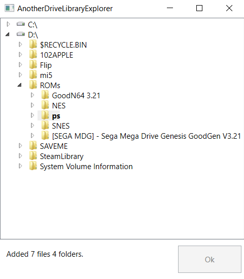

# AnotherDriveLibraryExplorer

AnotherDriveLibraryExplorer is GUI application based on WPF for handy adding selected parts of a file system to [AnotherDrive](https://github.com/tuxtender/AnotherDrive). Server-side app have to running on Windows. On a server with massive  number of  files (e.g., photo library) is easy add they  to app.

* UI snapshot


 

Caveats
-------
* Repeat add directory will duplicate it in database at same name.
* No hint about already added directories.
* Not implement a thumbnail processing yet.

## Getting Started


### Prerequisites

.NET Framework 4.8

Microsoft.Data.Sqlite 3.1.10 is available on NuGet
```
Install-Package Microsoft.Data.Sqlite
```

## Usage

Place execute file in AnotherDrive database directory and run.


## Contributing

Pull requests are welcome. 

## Authors

* **Denis Vasilenko** - *Initial work* - [tuxtender](https://github.com/tuxtender)


## License 

[](https://www.gnu.org/licenses/gpl-3.0)

GNU GENERAL PUBLIC LICENSE  
Version 3, 29 June 2007

This program is free software: you can redistribute it and/or modify
it under the terms of the GNU General Public License as published by
the Free Software Foundation, either version 3 of the License, or
(at your option) any later version.

This program is distributed in the hope that it will be useful,
but WITHOUT ANY WARRANTY; without even the implied warranty of
MERCHANTABILITY or FITNESS FOR A PARTICULAR PURPOSE.  See the
GNU General Public License for more details.

You should have received a copy of the GNU General Public License
along with this program.  If not, see <https://www.gnu.org/licenses/>.